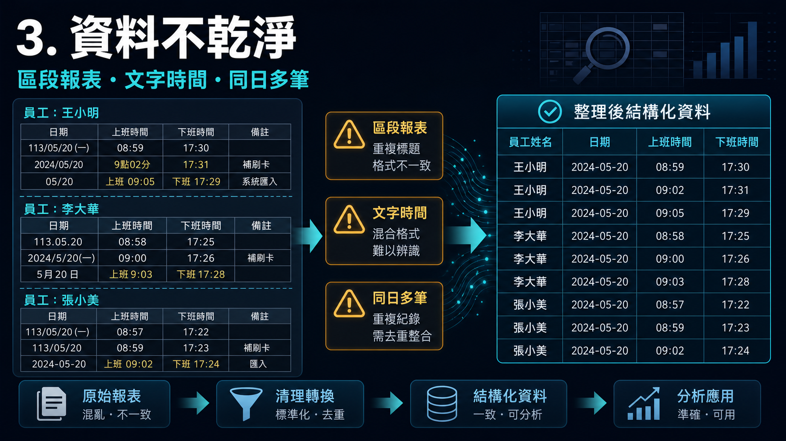
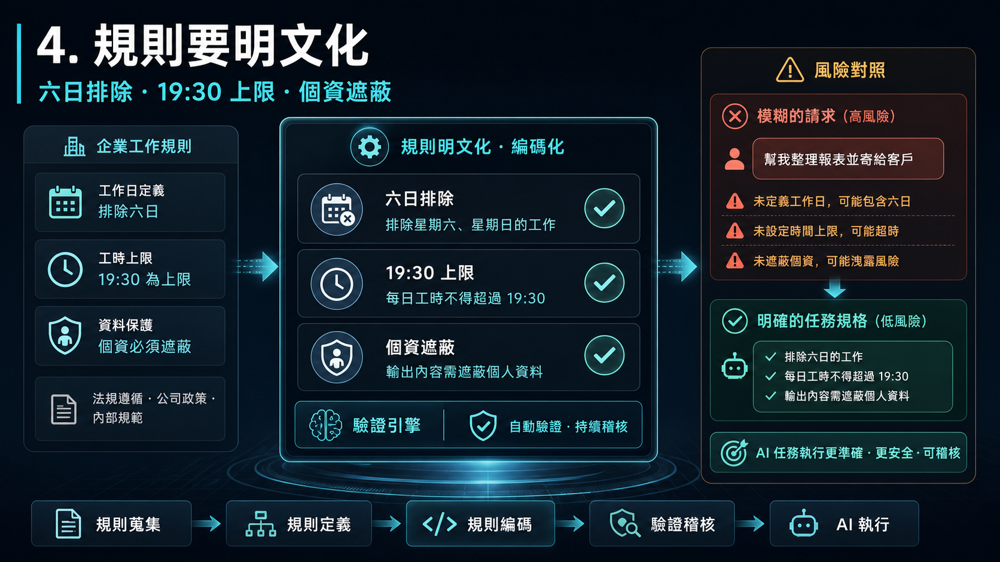
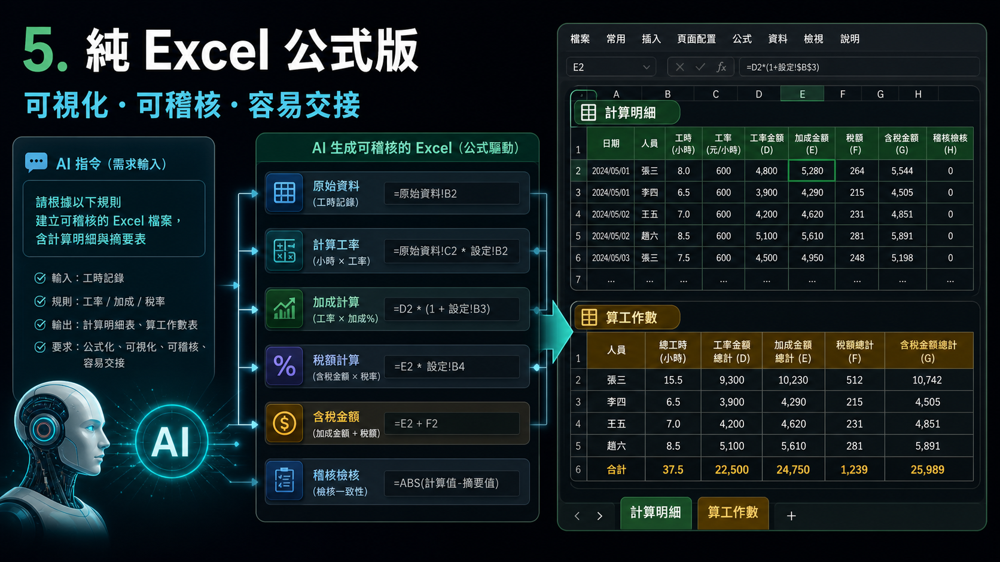
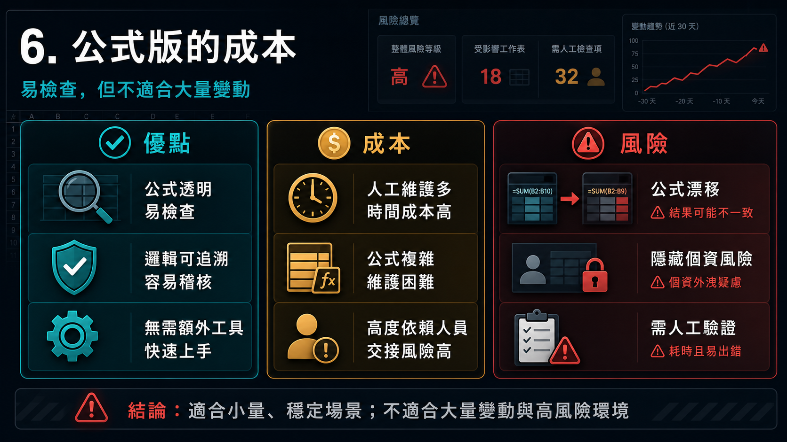
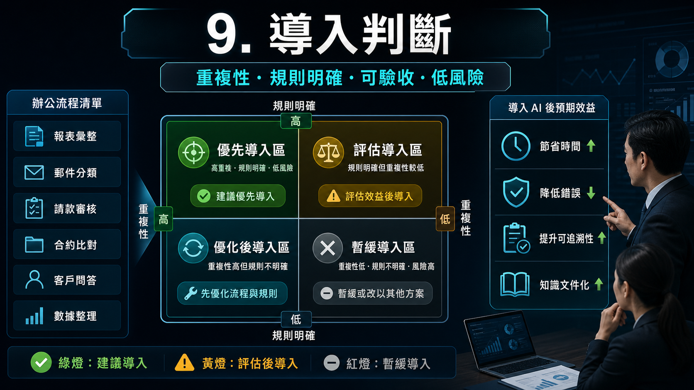
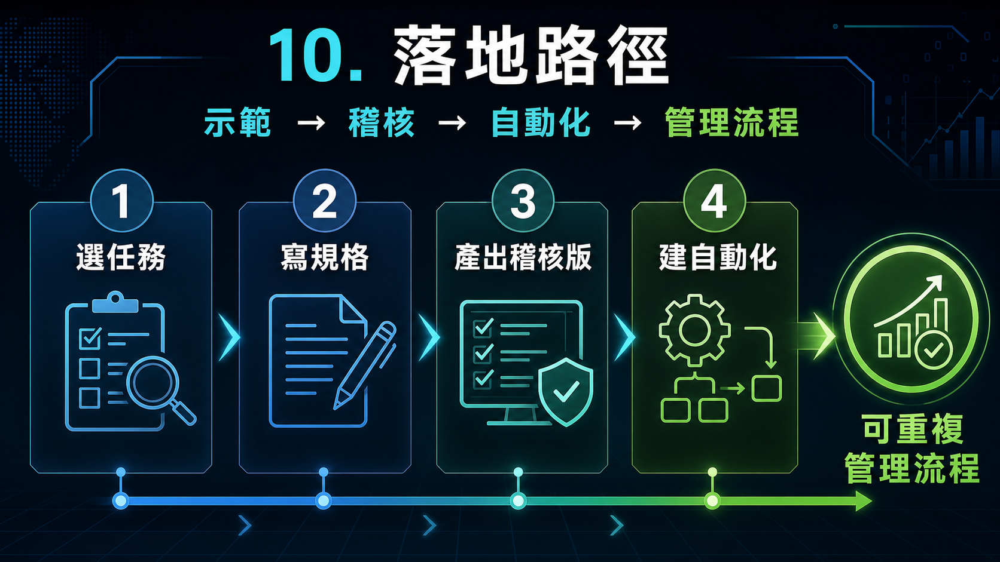

# 用 AI 處理日常辦公 Excel：從個人效率到公司導入決策

這份材料以 `excel-auto-codex` 子專案為案例，說明台南在地公司員工、主管與 AI 導入決策者，如何把日常辦公中的 Excel 整理問題，轉化成 AI 可以協助完成、驗證與重複使用的工作流程。案例核心是員工出勤資料：原始活頁簿採區段式報表格式，目標是依照明確規則計算每位員工每月的工作天數與工作總時數，並保護員工姓名與編號。[^problem]

---

## 1. 為什麼主管該關心

這個案例值得主管關心，因為它不是單純的「幫我算 Excel」問題，而是典型的辦公流程改善問題。原始報表格式複雜、資料欄位不乾淨、規則分散在人的經驗裡，每個月又可能重複發生。若每次都靠人工檢查、手動整理與口頭交接，公司會持續承擔時間成本、錯誤成本與人員交接風險。

從管理角度來看，這類任務正好適合用來判斷公司哪些工作值得 AI 化。它有明確規則、可驗收結果、可追蹤明細，也有個資遮蔽需求。這代表 AI 導入不只是追求工具新鮮感，而是把日常辦公問題轉成可執行、可驗證、可重複使用的流程。[^problem]

---

## 2. 把問題講清楚

員工要有效使用 AI，第一步不是學會寫程式，而是把自己的辦公需求講成可執行規格。以本案例來說，不能只對 AI 說「幫我算工時」，而要清楚交代來源檔案、來源工作表、輸出欄位、計算規則、例外情況、隱私要求與驗收方式。

本專案的題目文件已經把這些要求具體化：來源是 `2026.06月份.xlsx`，主要工作表包含 `算工作數` 與 `員工出勤明細表`；計算規則包含六日不計、下班時間最多算到 `19:30`、文字註記中要抓出最後出現的時間、同一員工同一天只算一次工作天數，以及成果中的員工資料需馬賽克。這種規格化描述，是公司推動 AI 辦公應用的基礎能力。[^problem]

---

## 3. 資料不乾淨

這份出勤資料的困難在於，它看起來是 Excel 表格，但實際上不是乾淨的分析資料表。每位員工都有自己的區段標題，每個區段又重複欄位名稱；員工標題列、製表資訊、日期列與空白列混在同一張工作表中。這會讓一般加總公式很難直接使用。

此外，日期可能以文字儲存，例如 `2026/06/08`；上班與下班欄位也可能混入文字註記，例如 `遲到08:25`、`早退15:39`、`病假12:23`。同一位員工同一天還可能有多筆紀錄，因此工作天數不能重複計算，但工時仍可能需要分段加總。這些特徵讓本案例成為很好的辦公 AI 導入範例：它不是單一公式問題，而是資料清理、規則套用與結果驗證的組合。[^problem]

---

## 4. 規則要明文化

AI 是否能產出可用結果，取決於業務規則是否被明確告知。本案例的規則包含：星期六與星期日不計入工作天數與工作總時數；下班晚於 `19:30` 時只算到 `19:30`；上班或下班空白時不計入工時；同一員工同一天只計一次工作天數；同一天多筆有效紀錄的工時可以加總；員工姓名與編號必須馬賽克。[^problem]

這些規則如果只存在於資深同仁腦中，就很難交給 AI、也很難交接給新人。導入 AI 的重要工作之一，是把隱性的作業知識寫成可檢查的規格。當規則被明文化後，不論最後採用純 Excel 公式或 Python 自動化，都能用同一組驗收條件檢查結果是否正確。[^results]

---

## 5. 純 Excel 公式版

第一種方案是請 AI 產生純 Excel 公式解法。這個方式保留原始 `員工出勤明細表`，新增 `計算明細` 工作表，用公式解析員工、日期、上班時間、下班時間、計算下班、工作時數與每日計數，再於 `算工作數` 彙總每位員工每月的工作天數與總工時。專案中已保存對應的純 Excel 解法說明與成果檔。[^excel_solution][^excel_workbook]

純 Excel 解法的價值在於可視化與可稽核。主管或行政同仁可以直接在 Excel 中看到中間欄位，逐步追蹤結果是如何產生的。對於導入初期、固定格式、少量檔案或需要人工複核的情境，這是一個容易被接受的第一版 AI 成果。[^analysis]

---

## 6. 公式版的成本

純 Excel 公式法的限制也很明顯。由於原始資料不是乾淨表格，公式解法需要多個輔助欄位來處理來源列、員工識別、日期解析、時間解析、工作日鍵、每日計數、月份與馬賽克員工名稱。這些欄位讓結果容易稽核，但也提高了建置與維護成本。[^analysis]

如果欄位順序、日期格式、員工標題格式或資料範圍改變，公式就可能需要調整。更大的風險是公式被覆蓋、拖曳錯位，或輔助欄位不小心留下未遮蔽個資。因此，純 Excel 解法適合導入初期與人工稽核，但若公司每月都要處理大量不同來源檔案，就不適合作為唯一長期方案。[^analysis]

---

## 7. Python 自動化

第二種方案是請 AI 產生 Python 自動化流程。專案中的 `attendance_python_solution.py` 會讀取來源 Excel，自動偵測出勤明細工作表，解析員工區段與日期列，處理文字日期、Excel 日期、文字時間、Excel 時間，以及結尾含時間的文字欄位。只要欄位標題可辨識，它也能支援欄位順序調整。[^python_script][^python_doc]

Python 解法會產生新的輸出活頁簿，不覆蓋原始檔；輸出保留原本工作簿結構，填入既有的 `算工作數` 工作表，並在員工欄套用 ID / 姓名遮蔽。它另外加入 `計算明細` 作為稽核用逐筆明細，但不新增 `處理說明` 這類非稽核工作表。對管理者來說，這代表 AI 不只是在回答一次性問題，而是可以協助建立公司內部可重複使用且可檢查的小工具。[^python_doc]

---

## 8. 驗證與擴充

本專案已對 2026 年 6 月原始檔做驗證。Python 解法解析出 `538` 筆日期列與 `16` 位員工，並與既有驗算結果比對為 `0` 筆不一致。純 Excel 公式版也保留了同一組預期結果，讓兩種方法可以互相參照與交叉驗證。[^results][^python_june_output]

為了測試泛用性，專案另外建立 2026 年 5 月隨機測試檔，使用 50 位虛構員工，保留相似的區段式報表結構，並加入空白日、週末測試資料、同日多筆出勤、遲到、早退、病假與晚於 `19:30` 的下班時間。Python 解法成功解析 `1691` 筆出勤日期列與 `50` 位員工，並產生對應結果檔。這個驗證重點不只是「能跑」，而是確認流程能處理類似但不完全相同的輸入資料。[^random_input][^python_may_output]

---

## 9. 導入判斷

主管與決策者在評估 AI 導入時，可以優先尋找這類工作：每月或每週重複發生、規則明確但人工處理繁瑣、原始資料格式不完美但結構大致固定、結果需要彙總檢查與留存，而且錯誤會造成管理或溝通成本。本案例符合這些條件，因此適合作為公司內部 AI 辦公導入的示範案例。

本案例能對應的管理價值包括減少人工整理時間、降低公式錯誤與漏算風險、建立標準化驗收規則、保留可追蹤計算明細，以及推動部門知識文件化。決策者不一定要要求每位員工都會寫程式，而是要建立一套方法，讓員工能把問題交代清楚，讓 AI 產出可驗證成果，再由主管決定哪些流程值得進一步標準化或自動化。[^analysis]

---

## 10. 落地路徑

建議的落地方式，是從低風險、高重複性的辦公任務開始，例如出勤彙總、報表整理、名單比對、費用分類或月報初稿。第一步先要求員工用固定格式描述任務，包含資料來源、處理規則、例外情況、輸出格式、驗收條件、個資與權限限制。這能把人的經驗整理成 AI 可以執行的規格。

第二步先產出可人工稽核的版本，例如純 Excel 公式版或含計算明細的輸出檔。當某項任務被證明會重複發生、規則穩定且驗收方式明確時，再進一步建立 Python 這類自動化腳本，保留輸入檔、輸出檔與稽核用計算明細。最終目標不是讓 AI 取代員工，而是讓員工把日常辦公經驗變成可重複、可檢查、可管理的公司流程。[^excel_workbook][^python_script][^analysis]

---

## References

[^problem]: [員工出勤工時計算問題](common/problem-statement.md)
[^excel_solution]: [純 Excel 公式解法說明](pure-excel/solution.md)
[^excel_workbook]: [2026.06月份-純Excel公式解.xlsx](pure-excel/2026.06月份-純Excel公式解.xlsx)
[^results]: [2026.06 純 Excel 公式解驗算結果](pure-excel/results.md)
[^analysis]: [純 Excel 公式法與 Python 解法比較分析](analysis/excel-vs-python-analysis.md)
[^python_doc]: [Python-based attendance solution](python-solution/python-solution.md)
[^python_script]: [attendance_python_solution.py](python-solution/attendance_python_solution.py)
[^python_june_output]: [2026.06月份-python工時計算.xlsx](python-solution/outputs/2026.06月份-python工時計算.xlsx)
[^random_input]: [2026.05月份-隨機出勤.xlsx](../data/2026.05月份-隨機出勤.xlsx)
[^python_may_output]: [2026.05月份-python工時計算.xlsx](python-solution/outputs/2026.05月份-python工時計算.xlsx)
